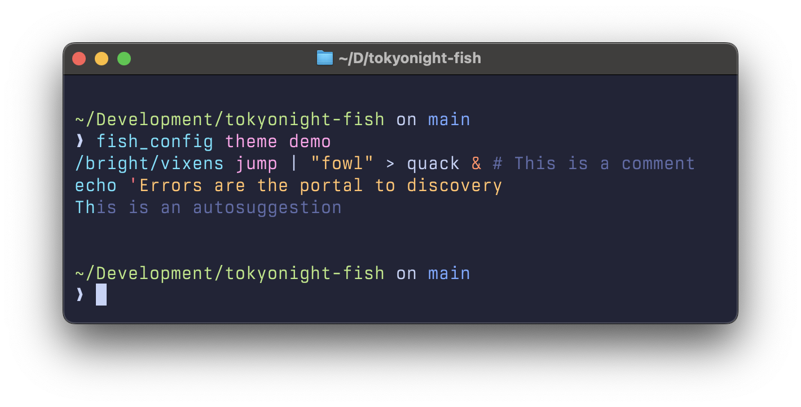

# TokyoNight colors for [fish shell](https://fishshell.com/)

This repo contains TokyoNight themes for convenient installation with [`fisher`](https://github.com/jorgebucaran/fisher):

## Installation

Install themes with `fisher`:

```sh
fisher install vitallium/tokyonight-fish
```

Choose the theme:

```sh
fish_config theme save "TokyoNight Night"
# or
fish_config theme save "TokyoNight Storm"
# or
fish_config theme save "TokyoNight Moon"
# or
fish_config theme save "TokyoNight Day"
```

## Previews

<details>
  <summary>TokyoNight Night</summary>
  
</details>

<details>
  <summary>TokyoNight Storm</summary>
  
</details>

<details>
  <summary>TokyoNight Moon</summary>
  
</details>

<details>
  <summary>TokyoNight Day</summary>
  
</details>

## Credits

All colors were taken from [the original repo](https://github.com/folke/tokyonight.nvim/blob/main/extras/fish/).
